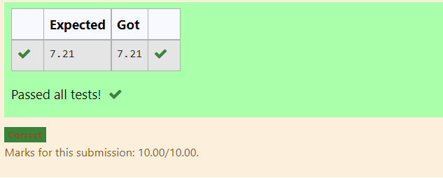

# DISTANCE-BETWEEN-TWO-POINTS

## AIM:
To write a python program to find the distance two 2 points
## ALGORITHM:
### Step 1:
import maths
### Step 2:
type the values of the given matrix
### Step 3: 
Substitute the values in the distance formula 
### Step 4:
use print function and run the program

### PROGRAM:
'''
#Program to find the distance between two points.
#Developed by: LAKSHMI PRIYA P
#RegisterNumber:21001411

import math
x=[10,6]
y=[4,2]
dist=math.sqrt((10-4)**2+(6-2)**2)
print("{:.2f}".format(dist))
'''
  
### OUTPUT:

### RESULT:
the above program is verified and created  successfully. 
